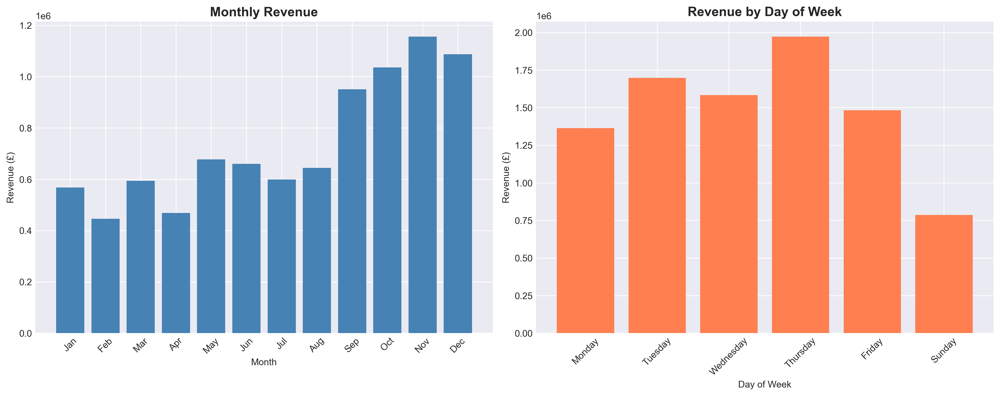
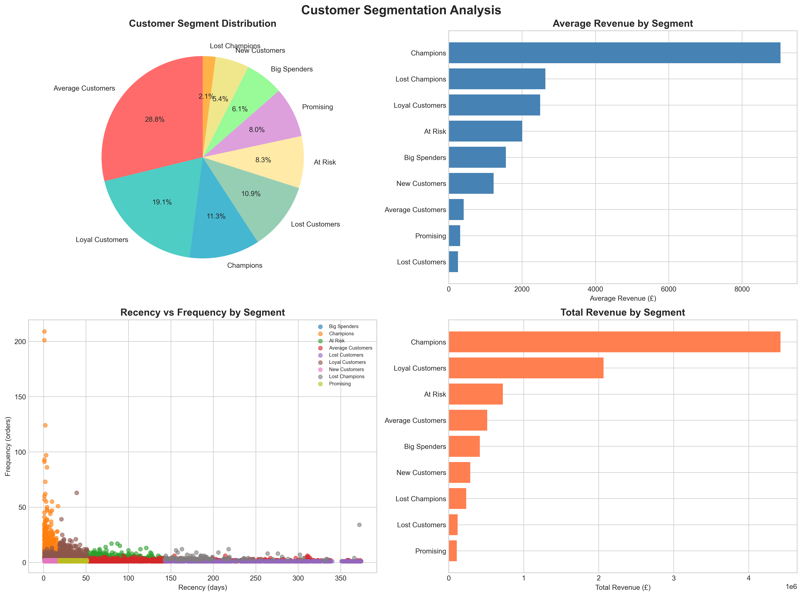
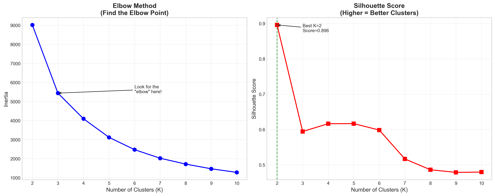
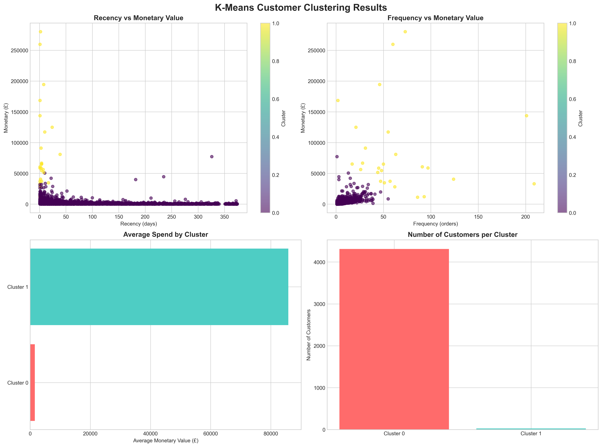
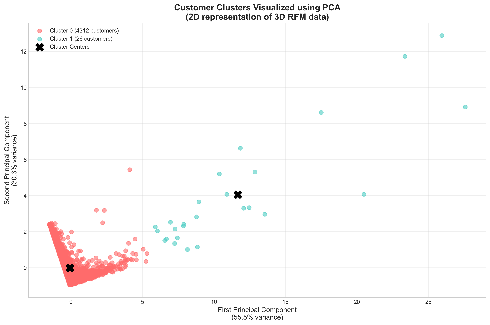

# Customer Segmentation Analysis with Machine Learning


> Advanced customer segmentation using RFM Analysis and K-Means Clustering to identify high-value customers and optimize marketing strategies

---

## Project Overview

This project analyzes **392,692 transactions** from a UK-based online gift retailer to segment customers based on purchasing behavior. Using both **RFM Analysis** and **K-Means Machine Learning**, I identified distinct customer groups and provided actionable business recommendations.

### Key Results
- Analyzed **£8.89M** in revenue across **4,338 customers**
- Identified **26 VIP customers** (0.6%) generating **£2.2M** in revenue
- Created **9 RFM segments** and **2 ML clusters**
- Achieved **0.896 Silhouette Score** (excellent clustering quality)


## Project Structure
```
customer-segmentation-project/
│
├── 01_Data_Exploration.ipynb          # Data cleaning & EDA
├── 02_RFM_Analysis.ipynb              # RFM customer segmentation
├── 03_KMeans_Clustering.ipynb         # Machine Learning clustering
│
├── data/
│   └── Online Retail.xlsx             # Raw dataset (UCI ML Repository)
│
├── outputs/
│   ├── cleaned_retail_data.csv        # Cleaned dataset
│   ├── rfm_analysis.csv               # RFM scores & segments
│   └── final_customer_segments.csv    # ML cluster assignments
│
├── visualizations/
│   ├── 01_top_countries.png           # Geographic analysis
│   ├── 02_sales_patterns.png          # Temporal patterns
│   ├── 03_rfm_segments.png            # RFM segmentation results
│   ├── 04_elbow_method.png            # Optimal K selection
│   ├── 05_kmeans_clusters.png         # Cluster characteristics
│   └── 06_pca_clusters.png            # 2D cluster visualization
│
└── README.md                           # Project documentation
```

---

## Technologies & Skills

### Programming & Libraries
- **Python 3.11** - Core programming language
- **pandas & NumPy** - Data manipulation and analysis
- **Matplotlib & Seaborn** - Data visualization
- **scikit-learn** - Machine learning algorithms

### Machine Learning
- **K-Means Clustering** - Unsupervised learning algorithm
- **StandardScaler** - Feature normalization
- **PCA** - Dimensionality reduction for visualization
- **Elbow Method** - Optimal cluster selection
- **Silhouette Score** - Cluster quality validation

### Analytical Techniques
- **RFM Analysis** (Recency, Frequency, Monetary)
- **Exploratory Data Analysis (EDA)**
- **Data Cleaning & Preprocessing**
- **Feature Engineering**
- **Statistical Analysis**
- **Business Intelligence**

---

## Dataset

**Source:** UCI Machine Learning Repository - Online Retail Dataset

**Description:** Transnational data from UK-based online gift retailer

**Period:** December 2010 - December 2011

**Raw Data:**
- 541,909 transactions
- 8 columns (InvoiceNo, StockCode, Description, Quantity, InvoiceDate, UnitPrice, CustomerID, Country)

**After Cleaning:**
- 392,692 clean transactions (27.5% removed)
- 4,338 unique customers
- 3,877 unique products
- 37 countries
- £8,887,208.89 total revenue

---

## Methodology

### 1️⃣ Data Exploration & Cleaning

**Challenges Addressed:**
- ❌ Missing CustomerIDs (135,080 rows - 24.93%)
- ❌ Duplicate records (5,268 rows)
- ❌ Cancelled orders (9,288 rows)
- ❌ Negative quantities (10,624 rows - returns)
- ❌ Invalid prices (2,517 rows)

**Solution:** Comprehensive data cleaning pipeline removing all invalid records

**Key Insights:**
- UK represents 91% of transactions (495,478 orders)
- November shows highest sales (seasonal pattern)
- Thursday is the busiest shopping day
- Average order value: £479.56

---

### 2️⃣ RFM Analysis

**Methodology:**
Calculated three key metrics for each customer:
- **R (Recency)**: Days since last purchase
- **F (Frequency)**: Number of orders placed
- **M (Monetary)**: Total amount spent

Divided customers into **quartiles** (1-4 scores) for each metric, creating **9 distinct segments**:

| Segment | Count | Revenue | Characteristics |
|---------|-------|---------|-----------------|
| **Champions** | 489 (11.3%) | £4.42M | High R, F, M scores |
| **Loyal Customers** | 828 (19.1%) | £2.06M | Consistent buyers |
| **At Risk** | 360 (8.3%) | £721K | Previously valuable, now inactive |
| **Average Customers** | 1,250 (28.8%) | £513K | Middle-tier performance |
| **Lost Customers** | 473 (10.9%) | £119K | Long inactive period |
| **New Customers** | 234 (5.4%) | £287K | Recent first purchase |
| **Big Spenders** | 266 (6.1%) | £414K | High monetary, low frequency |
| **Promising** | 349 (8.0%) | £109K | Potential to become loyal |
| **Lost Champions** | 89 (2.1%) | £234K | Former champions, now lost |

**Key Finding:** Top 30% of customers (Champions + Loyal) generate **72% of revenue**

---

### 3️⃣ K-Means Machine Learning Clustering

**Feature Engineering:**
- Used RFM values as features
- Applied StandardScaler for normalization (critical for distance-based algorithms)

**Model Selection:**
- Tested K=2 through K=10 clusters
- Used **Elbow Method** to identify optimal K
- Validated with **Silhouette Score**

**Results:**
- **Optimal K = 2** clusters
- **Silhouette Score = 0.896** (excellent separation)

**Cluster Profiles:**

| Cluster | Type | Size | Avg Recency | Avg Frequency | Avg Spend |
|---------|------|------|-------------|---------------|-----------|
| **1** | VIP Customers | 26 (0.6%) | 6 days | 66 orders | **£85,826** |
| **0** | Regular Customers | 4,312 (99.4%) | 93 days | 4 orders | £1,543 |

**Critical Insight:** 
> Just **26 customers** (0.6% of customer base) spend an average of **£85,826 each**, representing approximately **25% of total revenue**. This demonstrates the **Pareto Principle** (80/20 rule) in action.

---

### 4️⃣ PCA Visualization

Applied **Principal Component Analysis (PCA)** to visualize 3D RFM data in 2D space:
- First component explains **55.5% of variance**
- Second component explains **30.3% of variance**
- **Total variance captured: 85.8%**

The PCA visualization clearly shows two distinct customer groups, validating the K-Means clustering results.

---

## Business Recommendations

### For VIP Customers (Cluster 1 - 26 customers, £2.2M revenue)
- Assign dedicated account managers
- Exclusive early access to new products
- VIP-only events and experiences
- Personal relationship building
- **Risk:** Losing even ONE VIP = £85K revenue loss

### For Champions & Loyal Customers (RFM segments)
- Loyalty rewards program
- Personalized product recommendations
- Exclusive discounts on premium items
- Gamification to maintain engagement

### For At-Risk Customers (360 customers, £721K at risk)
- **Urgent Action Required**
- Personalized reactivation campaigns
- Win-back offers (15-20% discount)
- Direct outreach to understand issues

### For Average Customers (4,312 customers)
- Focus on increasing purchase frequency
- Cross-sell and upsell campaigns
- Regular engagement emails
- Loyalty point system

### For Lost Customers
- Last chance offers (30% discount)
- Exit surveys to understand churn
- Remove from active campaigns if no response

---

## Key Performance Indicators (KPIs)

| Metric | Value |
|--------|-------|
| **Total Revenue** | £8,887,208.89 |
| **Total Customers** | 4,338 |
| **Avg Revenue per Customer** | £2,048.94 |
| **Avg Order Value** | £479.56 |
| **Customer Retention Rate** | 60.1% (bought 2+ times) |
| **VIP Customer Value** | £85,826 avg |
| **Revenue Concentration** | Top 11.3% generate 49.8% of revenue |

---

## Visualizations

### Sales Patterns

*Monthly and daily revenue patterns showing strong seasonality*

### RFM Segmentation

*Distribution and characteristics of 9 customer segments*

### Elbow Method

*Optimal cluster selection using Elbow Method and Silhouette Score*

### K-Means Clustering

*Customer clusters by recency, frequency, and monetary value*

### PCA Visualization

*2D visualization of customer clusters using Principal Component Analysis*

---

## How to Run This Project

### Prerequisites
```bash
pip install pandas numpy matplotlib seaborn scikit-learn jupyter openpyxl
```

### Execution Steps

1. **Clone this repository**
```bash
git clone https://github.com/yourusername/customer-segmentation-project.git
cd customer-segmentation-project
```

2. **Launch Jupyter Notebook**
```bash
jupyter notebook
```

3. **Run notebooks in order:**
   - `01_Data_Exploration.ipynb` - Data cleaning
   - `02_RFM_Analysis.ipynb` - RFM segmentation
   - `03_KMeans_Clustering.ipynb` - ML clustering

4. **Output files will be generated in:**
   - `outputs/` - CSV files with results
   - `visualizations/` - PNG charts

---

## Key Learnings

1. **Data Quality is Critical**: Removed 27.5% of data due to quality issues
2. **Pareto Principle Applies**: 0.6% of customers drive 25% of revenue
3. **Multiple Approaches Validate Results**: Both RFM and K-Means identified similar high-value segments
4. **Feature Scaling Matters**: StandardScaler was essential for K-Means accuracy
5. **Business Context Over Algorithm**: Best K=2 from ML, but 9 RFM segments provide more actionable insights

---

## References & Resources

- **Dataset Source:** [UCI Machine Learning Repository](https://archive.ics.uci.edu/ml/datasets/Online+Retail)
- **Dua, D. and Graff, C. (2019).** UCI Machine Learning Repository. Irvine, CA: University of California, School of Information and Computer Science
- **RFM Analysis:** Industry standard customer segmentation methodology
- **K-Means Clustering:** MacQueen, J. (1967). "Some Methods for Classification and Analysis of Multivariate Observations"

---

## Author

**Mausami Narayan**

Email: mausmai464.mn@gmail.com  
LinkedIn: https://www.linkedin.com/in/mausami-narayan-70a1232a0/ 
GitHub: [Your GitHub Profile]

---

## License

This project is open source and available for educational purposes.

---

## Acknowledgments

- UCI Machine Learning Repository for providing the dataset
- The data analytics and machine learning community for tools and techniques
- Scikit-learn contributors for excellent ML library

---

## Project Status

**Completed** - February 2026

---

**⭐ If you found this project helpful, please give it a star!**

---

*This project demonstrates end-to-end data science workflow: from raw data to actionable business insights.*


